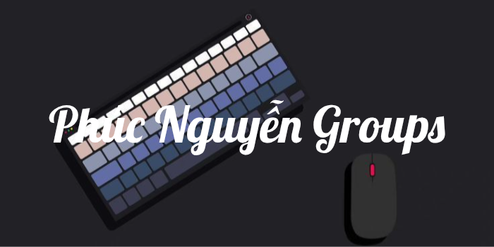

## 👋 Xin Chào ! mình là Phúc.

---

👉 Tham gia cộng đồng: [Tham gia ngay](https://discord.gg/HFDua7Yf5P)

---

---

## 🖥️ WEBSITE CODE EDITOR:

👉 Trang Chủ: [Xem Tại Đây](https://phucnguyengroups.github.io)

---
## ⚙️  TOOL FOR TERMUX:

👉 Tool dành cho Termux: [Xem Tại Đây](https://github.com/phucnguyengroups/tool-termux)

---

# 💻Tech Stack
     
# 📊GitHub Stats :
 
 

---
